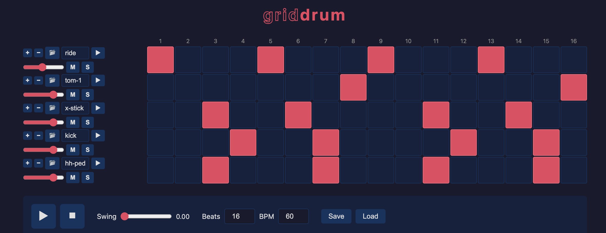

# GridDrum

A grid-based drum machine.

Currently on the web at [https://bwbensonjr.github.io/grid-drum](https://bwbensonjr.github.io/grid-drum).

## Directions

* Set number of beats/subdivisions (columns)
* Use "+" or "-" to add or delete samples
* Set tempo in beats-per-minute (BPM)
* Start and stop with buttons or space bar.
* Save and load current settings with Save/Load or by copying/bookmarking URL.
* Per-sample settings:
  * Audtion/Play
  * Volume
  * Mute (M)
  * Solo (S)
* Add an optional pattern name
* Reset to get default settings and empty grid

